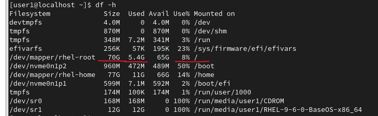
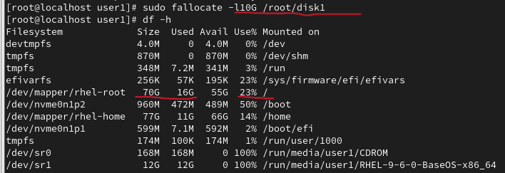
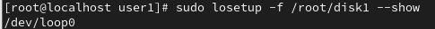
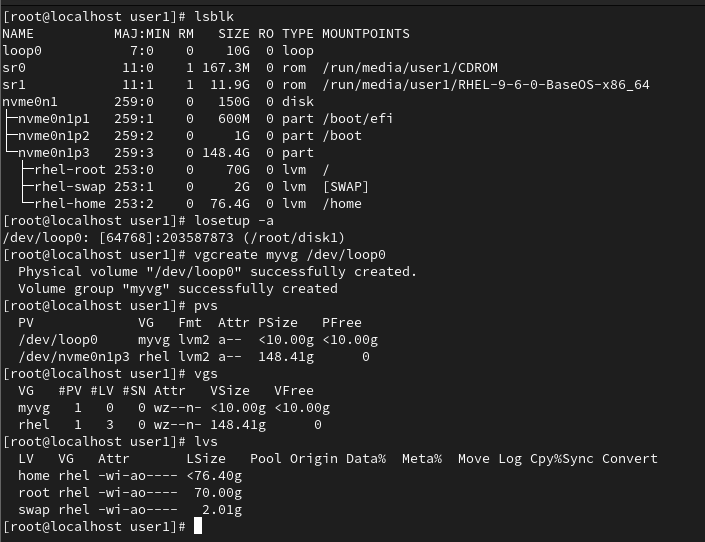
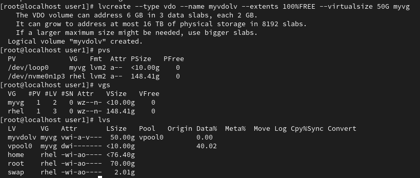
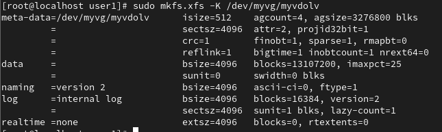
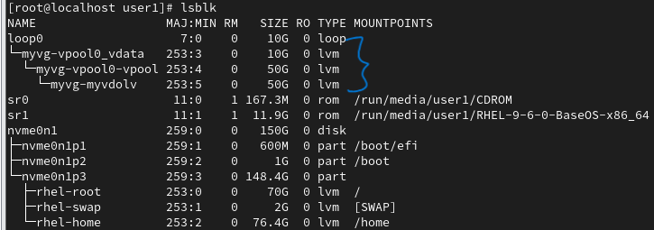
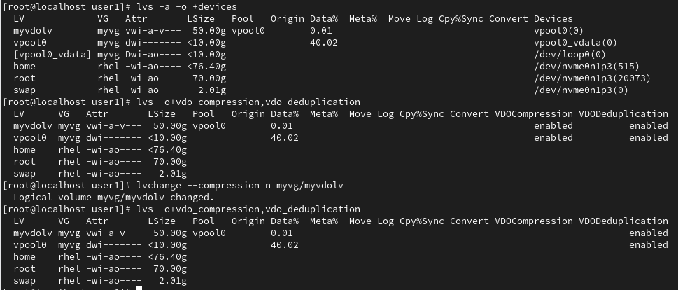
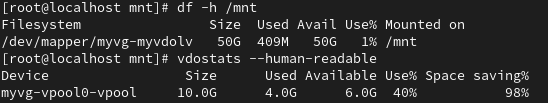
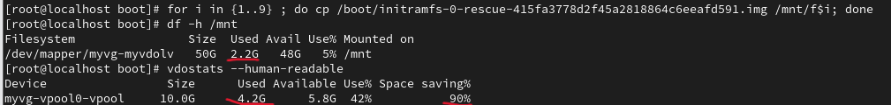

LVM (Logical Volume Manager)
============================
LVM is a flexible storage management system that allows you to create, resize, and manage logical storage volumes on top of physical storage devices (like disks or partitions).
It abstracts the physical disks and gives you logical control.

Basic Components:

PV (Physical Volume) – a physical disk or partition (can also be a loop device).

VG (Volume Group) – a pool of storage created by combining one or more PVs.

LV (Logical Volume) – a usable storage volume created from the VG (you format and mount this).


VDO (Virtual Data Optimizer)
============================
VDO adds data reduction capabilities — like:

    + Deduplication – removes duplicate data blocks.

    + Compression – reduces the size of stored data.

    + Thin provisioning – allocates space only when data is written.

In short, VDO helps save disk space by storing data more efficiently.


Note: 

Loop Devices:
-------------
VDO volumes (LV) can't be created directly on the loop devices; however, loop devices can be part of a volume group (VG).


Practical process:
==================

Before going into practical, I need to install lvm, vdo, Kernel module, kvdo

    sudo dnf install -y lvm2 vdo kmod-kvdo


Currently I don't have an extra physical disk to practice LVM and VDO on, I am simulating a disk using empty file.

1. Create an empty file for disk simulation
    
    
    

    sudo fallocate -l10G /root/disk1

    

    note:
        I am creating a 10 GB sparse file. This file simulates a real disk, which is great for labs. It contains no data yet; space is just reserved logically on the filesystem.
    
        In a production setup, this step would correspond to using a real disk (like /dev/sdb).


2. Attach it as a loop device

    sudo losetup -f /root/disk1 --show

    

    note:
        
        -f = Finds the first free loop device
        --show = prints the first free loop device

        From now on, /dev/loopxy behaves just like a physical disk to the Linux kernel

        For checking
            lsblk
            losetup -a


3. Create a Volume Group (VG)

    vgcreate myvg /dev/loopxy

    note:
        vgcreate first creates a Physical Volume (PV) on /dev/loopxy. Then it groups that PV into a VG called myvg

    


4. Create LVM-based VDO volume

    sudo lvcreate --type vdo --name myvdolv --extents 100%FREE --virtualsize 50G myvg

    note:
        Under the hood, LVM creates two related volumes:

        1. A VDO data LV (stores actual data).

        2. A VDO metadata LV (stores deduplication/compression metadata).

        Because VDO supports **thin provisioning**, you can make the logical size (50G) larger than the physical space (10 GB loop device) — the VDO engine compresses and deduplicates data to fit it efficiently.

        


5. Format the new logical volume with the XFS filesystem (recommended for VDO)

    sudo mkfs.xfs -K /dev/myvg/myvdolv

     

     


Monitor LV VDO
==============

lvs -a -o +devices

By Default, both compression and data-deduplication is enabled

    lvs -o+vdo_compression,vdo_deduplication

You can enable/disable it at pool level

    lvchange --compression y|n myvg/myvdolv

    lvchange --deduplication y|n myvg/myvdolv

 

To view the space

    vdostats --human-readable


Example:

Mount VDO LV to temporary area
    mount /dev/myvg/myvdolv /mnt

    note:
        Before:
            df -h /mnt
            vdostats --human-readable

 

        for i in {1..9} ; do cp /boot/initramfs-0-rescue-415fa3778d2f45a2818864c6eeafd591.img /mnt/f$i; done


        After:
            df -h /mnt
            vdostats --human-readable

 


Cleanup
=======
    umount /mnt
    lvremove /dev/myvg/myvdolv -y
    vgremove myvg -y
    losetup -d /dev/loop0
    rm -f /root/disk1


Note:

The purpose of fallocate and losetup, These are lab simulation tools. I am using them only because:

    - I don’t have a real extra disk in your RHEL VM, and
    - I still want to practice LVM and VDO creation safely.

When I have a real extra hard disk
-----------------------------------

If I have a real second disk, say /dev/sdb, then:

    - I do not need fallocate

    - I do not need losetup

Because /dev/sdb is already a real block device, and Linux can use it directly for LVM or VDO.

````bash
# Suppose your extra disk is /dev/sdb
lsblk

# Create volume group directly on the real disk
vgcreate myvg /dev/sdb

# Create VDO logical volume
lvcreate --type vdo --name myvdolv --virtualsize 50G myvg

# Format it
mkfs.xfs /dev/myvg/myvdolv

# Mount and use
mkdir /mnt/vdo
mount /dev/myvg/myvdolv /mnt/vdo
````


Real-time, practical scenarios where VDO (Virtual Data Optimizer) is genuinely useful
======================================================================================

1. Virtualization Environments (KVM, VMware, etc.)

- Virtual machines often have duplicate data (same OS files, same packages).
- VDO’s deduplication stores those identical blocks only once.
- we can host more VMs on less physical storage.

2. Backup and Archiving Systems

Backups have lots of repeated data (incremental copies, same files).
    - VDO stores identical blocks only once.
    - Combined with compression, you drastically cut storage usage.

3. Private and Hybrid Cloud Storage (OpenStack, OpenShift)

Cloud workloads generate lots of images and containers that share base layers.
    - Deduplication + compression reduce the footprint of container and VM images.
    - Thin provisioning lets you overcommit storage safely.