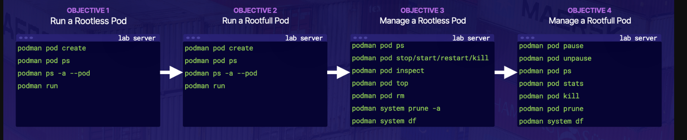

# Managing Pods Using Podman on RHEL

## Introduction

Unlike Docker’s single-container concept, Podman brings the ability to run multiple containers in a single pod. This practice lab will extend my podman skills to manage multiple containers as part of a pod.

In order to explore managing pods with Podman, I am going to stand up **one rootless WordPress pod and one rootfull WordPress pod**. The below image provides an overview and commands used to manage pods:

## Solution

When the lab starts, open an SSH connection to your lab instance, replacing PUBLIC_IP_ADDRESS with either the Public IP or DNS hostname of the instance:

    ssh cloud_user@<PUBLIC_IP_ADDRESS>

### Run a Rootless Pod

Check for existing rootless containers and pods using the --pod option to show the ID and name of the pod that the containers belong to:

    podman ps -a --pod

Check for any existing pods:

    podman pod ps

Create a pod named wp-pod, with port 80 in the pod published to 8080 on the host:

    podman pod create --name wp-pod -p 8080:80

    podman pod ps # The wp-pod you just created should now be listed

    podman ps -a --pod # Check for any existing containers again

    The infra container created by default with the wp-pod should now be listed. The pod's published port are also listed, confirming that port 80 has been published to 8080.

Add a mariadb container named wp-db (with a short name of mariadb) to the wp-pod pod with the following parameters and environment variables:

    It is set to --restart=always

    The MYSQL_ROOT_PASSWORD is dbpass

    The MYSQL_DATABASE is wp

    The MYSQL_USER is wordpress

    The MYSQL_PASSWORD is wppass

    podman run -d --restart=always --pod=wp-pod -e MYSQL_ROOT_PASSWORD="dbpass" -e MYSQL_DATABASE="wp" -e MYSQL_USER="wordpress" -e MYSQL_PASSWORD="wppass" --name=wp-db mariadb
    
    Check for containers again:

        podman ps -a --pod # The mariadb container named wp-db you just started should now be listed.

Add a Wordpress container named wp-web (with a short name of wordpress) to the wp-pod pod with the following parameters and environment variables:

    It is set to --restart=always

    The WORDPRESS_DB_NAME is wp

    The WORDPRESS_DB_USER is wordpress

    The WORDPRESS_DB_PASSWORD is wppass

    The WORDPRESS_DB_HOST is 127.0.0.1

    podman run -d --restart=always --pod=wp-pod -e WORDPRESS_DB_NAME="wp" -e WORDPRESS_DB_USER="wordpress" -e WORDPRESS_DB_PASSWORD="wppass" -e WORDPRESS_DB_HOST="127.0.0.1" --name wp-web wordpress
    
    Check for containers again:
    
        podman ps -a --pod # The wordpress container named wp-web you just started should now be listed.

Using curl, check that the webserver on the Wordpress server is accessible via the published ports and is working properly:

    curl -s http://localhost:8080

    Immediately check the exit code:

    echo $?

    The exit code that is returned should be 0, confirming that everything is working as expected.

    In a web browser, navigate to the Public IP address or DNS hostname for the lab instance (provided with the lab credentials) on port 8080, and verify that the Wordpress page displays.

### Run a Rootfull Pod

Become the root user:

    sudo -i

Check for existing rootfull containers and pods using the --pod option:

    podman ps -a --pod

Check for any existing pods:

    podman pod ps

Create a pod named root-wp-pod, with port 80 in the pod published to 8081 on the host:

    podman pod create --name root-wp-pod -p 8081:80

    Check for any existing pods again:

        podman pod ps

    Check for any existing containers again:

        podman ps -a --pod

    The infra container created by default with the root-wp-pod should now be listed. The pod's published port are also listed, confirming that port 80 has been published to 8081.

Add a mariadb container named root-wp-db (with a short name of mariadb) to the root-wp-pod pod with the following parameters and environment variables:

    It is set to --restart=always

    The MYSQL_ROOT_PASSWORD is dbpass

    The MYSQL_DATABASE is wp

    The MYSQL_USER is wordpress

    The MYSQL_PASSWORD is wppass

    podman run -d --restart=always --pod=root-wp-pod -e MYSQL_ROOT_PASSWORD="dbpass" -e MYSQL_DATABASE="wp" -e MYSQL_USER="wordpress" -e MYSQL_PASSWORD="wppass" --name=root-wp-db mariadb

    Check for containers again:

        podman ps -a --pod # The mariadb container named root-wp-db you just started should now be listed.

Add a Wordpress container named root-wp-web (with a short name of wordpress) to the root-wp-pod pod with the following parameters and environment variables:

    It is set to --restart=always

    The WORDPRESS_DB_NAME is wp

    The WORDPRESS_DB_USER is wordpress

    The WORDPRESS_DB_PASSWORD is wppass

    The WORDPRESS_DB_HOST is 127.0.0.1

    podman run -d --restart=always --pod=root-wp-pod -e WORDPRESS_DB_NAME="wp" -e WORDPRESS_DB_USER="wordpress" -e WORDPRESS_DB_PASSWORD="wppass" -e WORDPRESS_DB_HOST="127.0.0.1" --name wp-web wordpress

    Check for containers again:

        podman ps -a --pod # The wordpress container named root-wp-web you just started should now be listed.

Using curl, check that the webserver on the Wordpress server is accessible via the published ports and is working properly:

    curl -s http://localhost:8081

    Immediately check the exit code:

    echo $?

    The exit code that is returned should be 0, confirming that everything is working as expected.

In a web browser, navigate to the Public IP address or DNS hostname for the lab instance (provided with the lab credentials) on port 8081, and verify that the Wordpress page displays.

Log out as the root user:

exit

### Manage a Rootless Pod

Stop, Start, and Restart the wp-pod Pod and Its Containers

Check for any rootless containers and pods that are currently running, using the podman pod ps and podman ps -a --pod commands. The wp-pod pod and its containers — wp-web, wp-db, and infra — should all be listed.

Stop the pod, along with all of its containers, using the podman pod stop command:

    podman pod stop wp-pod

Check the status of the containers and pods:

    podman ps -a --pod

    The wp-pod pod and the wp-web, wp-db, and infra containers should all be listed as exited, or stopped.

Start the pod and its containers again, using the podman pod start command:

    podman pod start wp-pod

Check the status of the containers and pods again:

    podman ps -a --pod

    The wp-pod pod and the wp-web, wp-db, and infra containers should all be listed as up or running.

Restart the pod and its containers, using the podman pod restart command:

    podman pod restart wp-pod

Check the status of the containers and pods again:

    podman ps -a --pod

    The wp-pod pod and the wp-web, wp-db, and infra containers should all be listed as up or running.

#### Get information about the pod using the podman pod inspect command:

    podman pod inspect wp-pod | more

    This provides detailed information about the wp-pod pod, such as when it was created, its current status, its containers, and the IDs, names, and states of those containers.

View the pod's processes, using the podman pod top command:

    podman pod top wp-pod

    This returns all the processes associated with the pod.

#### Clean Up the wp-pod Pod and Its Containers

Check for any existing rootless containers and pods, using the podman pod ps and podman ps -a --pod commands. The wp-pod pod and its containers — wp-web, wp-db, and infra — should all be listed.

Kill the wp-pod pod and all of its containers:

    podman pod kill wp-pod

    Check the status of the pod and its containers, using the podman pod ps and podman ps -a --pod commands. The wp-pod pod and its containers — wp-web, wp-db, and infra — should all be listed as exited.

Remove the wp-pod pod and all of its containers:

    podman pod rm wp-pod

    Check the status of the pod and its containers again, using the podman pod ps and podman ps -a --pod commands. The wp-pod pod and its containers — wp-web, wp-db, and infra — should all be listed as removed.

Check the storage utilization for the system:

    podman system df

    It shows that there is some space that is reclaimable.

Clean up and reclaim the available storage space, using the podman pod prune command:

    podman system prune -a

    When prompted, enter y to continue.

Check the storage utilization again:

    podman system df

    It now shows that there is no longer any reclaimable space.

### Manage a Rootfull Pod

Pause and Resume the root-wp-pod Pod and Its Containers

Become the root user:

    sudo -i

Check for any rootfull containers and pods that are currently running, using the podman pod ps and podman ps -a --pod commands. The root-wp-pod pod and its containers — root-wp-web, root-wp-db, and infra — should all be listed.

Pause the pod, along with all of its containers, using the podman pod pause command:

    podman pod pause root-wp-pod

    Check the status of the pod and its containers again, using the podman pod ps and podman ps -a --pod commands. The root-wp-pod pod and its containers — root-wp-web, root-wp-db, and infra — should all be listed as paused.

Unpause the pod, along with all of its containers, using the podman pod unpause command:

    podman pod unpause root-wp-pod

    Check the status of the pod and its containers again, using the podman pod ps and podman ps -a --pod commands. The root-wp-pod pod and the root-wp-web, root-wp-db, and infra containers should all be listed as up or running.

#### Get Information About the root-wp-pod Pod and Its Containers

Get performance statistics about the pod using the podman pod stats command:

    podman pod stats root-wp-pod

    This provides near real-time resource utilization for the root-wp-pod pod and its containers, such as CPU percentage, memory usage, etc.

    Press Ctrl+C to exit the resource utilization view.

Stop the pod and its containers, using the podman pod stop command:

    podman pod stop root-wp-pod
    
Check for any reclaimable space:

    podman system df

    It shows that there is some space that is reclaimable.

Clean up and reclaim the available storage space, using the podman pod prune command:

    podman pod prune

    When prompted, enter y to continue.

Check the storage utilization again:

    podman system df

    It only cleaned up space being utilized in Containers and Local Volumes, but not Images.

Clean up and reclaim the remaining available storage space, using the podman system prune command:

    podman system prune -a

    When prompted, enter y to continue.

Check the storage utilization again:

    podman system df

    It now shows that there is no longer any reclaimable space.

Check the status of the pod and its containers one last time, using the podman pod ps and podman ps -a --pod commands. There are no pods or containers listed.