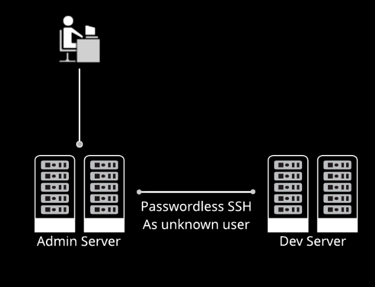
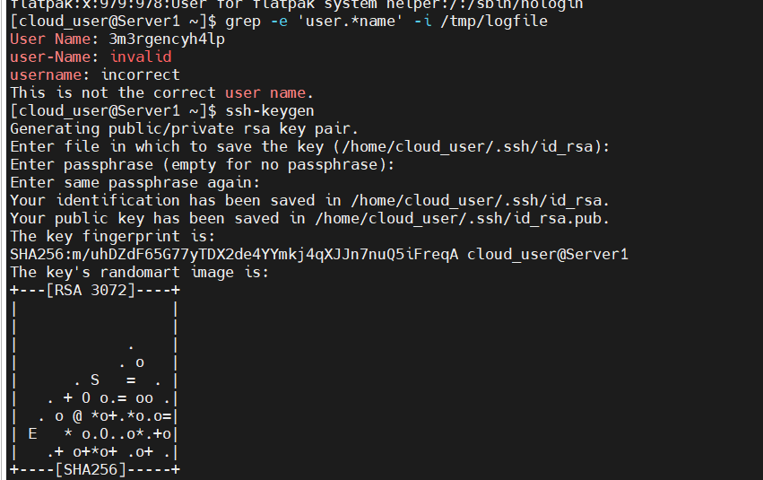
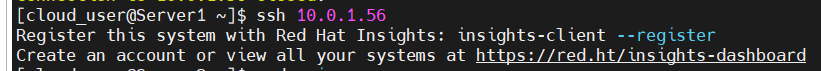
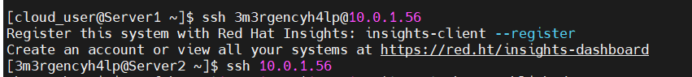
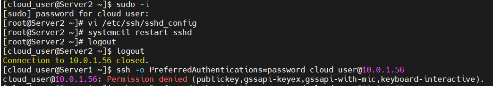

# The Scenario

One of the junior admins has left the company and we have been tasked with cleaning up some of his mess. He was setting up a server (Server2) for the developers to use. The developers should only ever connect to it from Server1, using an SSH key (no passwords).

There is a user already created on that server, but no one is sure what the username is. The log file, /tmp/logfile, on Server1 contains the username, but we'll have to search for it. It should be labeled "username" or "user-name" or something like that. We can do this with grep.

Once we've found the username and created SSH keys to access the server (using ssh-keygen), we need to copy them across and set the server up so that it doesn't allow password connections at all. The ssh-copy-id command will do this for us.

Then, we'll need to edit /etc/ssh/sshd_config on Server2, to disable password authentication.

Note: 

- Server1 = Admin / jump server (sometimes called a bastion host), Server1 acts as a controlled gateway.
- Prevents brute-force password attacks
- Creates a single audit point (Server1)
- Makes it easy to revoke access

 


1. Logging In: I am the admin, I use the admin credentials to login into Server1.

2. Find the Username That the Other Admin Created

    There are over x no.of lines in /tmp/logfile so we don't want to do it by hand. While we don't know the exact format we're searching for, we're fairly confident that it's some form of the word "username".
    
    ````
    grep -e 'user.*name' -i /tmp/logfile
    ````

    That will match any iteration of 'user', followed by any character (or no character), followed by 'name'.


3. Create an SSH Key

    Use the command ssh-keygen (accept the defaults at all of the prompts) to generate a key that we can use to copy to the other server to allow passwordless connections.




4. Copy the SSH Key to the User Whose Name You Discovered in the First Task

    Use the ssh-copy-id command to copy the SSH key to the new user name (3m3rgencyh4lp) on the second server. The password for each user is the same incase multiple users.

    [cloud_user@Server1 ]# ssh-copy-id cloud_user@<Server2_INTERNAL_IP_ADDRESS>

    [cloud_user@Server1 ]# ssh-copy-id 3m3rgencyh4lp@<Server2_INTERNAL_IP_ADDRESS>

    Now we can test with two ssh commands:

        ssh cloud_user@<Server2_INTERNAL_IP_ADDRESS>

    

        Back out of that login, and try it for the other user:

        ssh 3m3rgencyh4lp@<Server2_INTERNAL_IP_ADDRESS>

    

        Just be sure you've substituted the correct Server2_INTERNAL_IP_ADDRESS in the commands. We should now be able to perform passwordless ssh logins.


5. Ensure That No One Can Use a Password to Log into Server2

    Now get out of that shell and come back in as cloud_user. Once we've logged in, we need to edit /etc/ssh/sshd_config and, with whichever text editor we like best, change the PasswordAuthentication variable to no. We're using vi as an example here:

    

    Once we've done that, restart the SSH daemon using sudo systemctl restart sshd.

    To test, try to log in with a password:

    [cloud_user@Server2 ]# ssh -o PreferredAuthentications=password cloud_user@localhost
    When it fails, we know we succeeded.