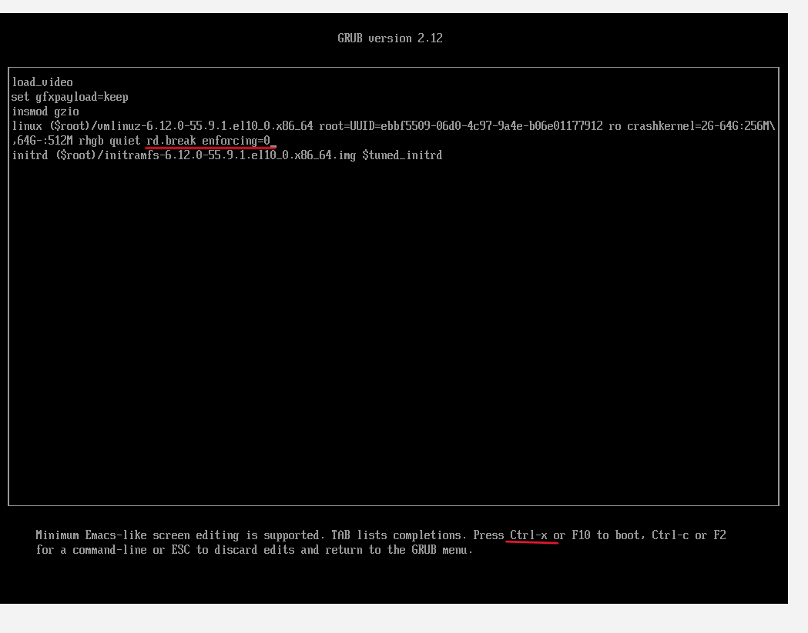
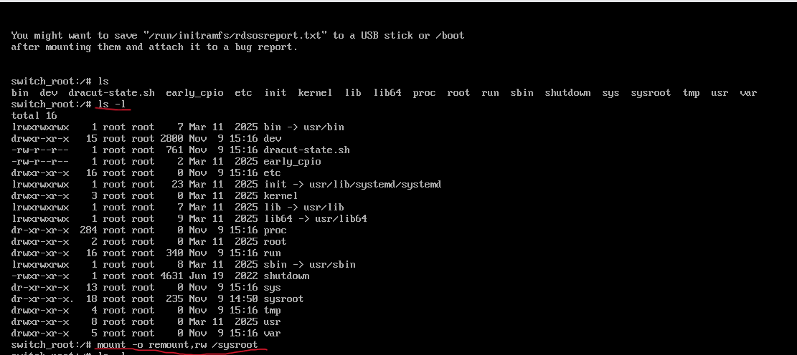
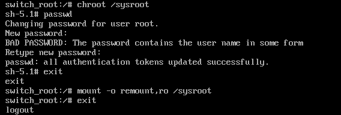

# RHCSA_Preparation


## Install RHEL

- using ISO, developer account subscription
- using Vagrant
 
## Connect to RHEL using SSH

In real time, remote login into the VM using the SSH. mostly using username and password, sometimes username and private key.

Full information: RHCSA_Preparation/ssh_to_VM
 

## Hypervisors

What is the Hypervisor?

Hypervisor is a software used to create and runs virtual machines on host machine. 

What Hypervisor will do?

Hypervisor abstracts the underliying resources of host machine and allows the host machine share hardware resources among the VMs.

Types of Hypervisors?

There are 2 types of hypervisors:

1. type 1 hypervisor (Bare metal or native)

    ------------------------
    | vm1 |  vm2  | ... vmn
    ------------------------
      hypervisor 
      (VMWare ESXi, Hyper-V)
    ------------------------
      Hardware resources
    ------------------------

2. type 2 hypervisor (Hosted Hypervisor)

    ------------------------
    | vm1 |  vm2  | ... vmn
    ------------------------
      hypervisor 
      (VMWare Workstation, 
      Oracle vm Virtual box)
    ------------------------
          Host OS
    ------------------------
      Hardware resources
    ------------------------

---

## Module 01 - linux Essentials

sudo useradd -m <username>

sudo passwd <username>

sudo usermod -aG <groupname> <username>
(or)
sudo groupmod -a -U <username> <group-name>


### About sudo

sudo -> used to elevated previliages of current user
sudo yum install -y bash-completion

Note:
The sudo command allows permitted users to execute commands as another user, typically root.

Configurations are managed in **/etc/sudoers or under /etc/sudoers.d/**.

You should never edit /etc/sudoers directly; instead use:
    sudo visudo
    
    
Edit /etc/sudoers.d/john to allow only specific commands:

    john ALL=(ALL) /bin/systemctl, /usr/bin/yum
    
    
How to check the groups the user belog to?

    sudo id -Gn user1

    or

    groups user1

    or

    id # current user full details
    

Question:
----------
Create a user named **devops** who can restart the httpd service using sudo but cannot run any other privileged command.

Create user
    sudo useradd -m devops
    sudo passwd devops
    # enter the password

Check the httpd service is installed
    sudo systemctl status httpd || sudo yum install -y httpd
    
    sudo systemctl status httpd
    
    sudo systemctl start httpd
    
    sudo systemctl enable httpd
    
    Check the user and group:
    -rw-r--r--.  1 root root   963 Jul 28 18:24 httpd.service
    
Create a sudoers policy file for the user

    We never edit /etc/sudoers directly — always use visudo or a file under /etc/sudoers.d/
    
    sudo visudo -f /etc/sudoers.d/devops
        
        devops ALL=(ALL) NOPASSWD: /bin/systemctl restart httpd, /bin/systemctl status httpd
        
        # devops ALL=(ALL) NOPASSWD: /bin/systemctl restart httpd.service, /bin/systemctl status httpd.service
    
    sudo ls -l /etc/sudoers.d
    
    -r--r-----.   1 root root  102 Nov  5 18:49 devops
    
    sudo systemctl stop httpd
    
Testing

    su - devops
    
    sudo systemctl status httpd
    
    sudo systemctl restart httpd
    
    sudo systemctl status httpd
    
    
    [devops@localhost ~]$ sudo cat /etc/shadow
    [sudo] password for devops: 
    Sorry, user devops is not allowed to execute '/bin/cat /etc/shadow' as root on localhost.localdomain.

    
    
Simllar questions:
1. Create a user named backup who can mount and unmount the device /dev/sdb1 on /mnt/backup using sudo, but cannot mount or unmount anything else.
    
    backup ALL=(ALL) NOPASSWD: /usr/bin/mount /dev/sdb1 /mnt/backup, /usr/bin/umount /mnt/backup

2. Create a user named operator who can restart and check the status of the SSH service using sudo.

    operator ALL=(ALL) NOPASSWD: /bin/systemctl restart sshd.service, /bin/systemctl status sshd.service

3. Create a user named ops who can execute the backup script /usr/local/bin/daily_backup.sh with sudo privileges and nothing else.

    ops ALL=(ALL) NOPASSWD: /usr/local/bin/daily_backup.sh
    
    

''''' system users (service accounts) ''''''


**What Are System Users?**

System users are **non-login users** created to **own or run services, scripts, or background processes**, not for interactive login.
They typically:

* Have **no home directory**
* Use **`/sbin/nologin`** or **`/bin/false`** as their shell
* Have **UIDs below 1000**
* Are used by system services like `apache`, `nginx`, `sshd`, etc.

You can see them in `/etc/passwd`:

```bash
grep -E 'nologin|false' /etc/passwd
```

---

**Creating a System User**

To create one manually:

```bash
sudo useradd -r -s /sbin/nologin -M scriptuser
```

**Flags:**

* `-r` → system account
* `-s /sbin/nologin` → prevent login
* `-M` → no home directory

---

**Why Use System Users for Scripts?**

System users are used when you want:

1. **A secure, isolated identity** to run a service or scheduled job (not a real person).
2. **Controlled sudo permissions** (can run one specific script only).
3. **Auditing** — any script action is logged as that user, not `root`.

This is ideal for:

* Automated backups
* Monitoring scripts
* CI/CD pipeline jobs
* Background daemons

---

**Example 1 — System User to Run a Script**

**Task**

Create a **system user** `backupsvc` that can run a backup script `/usr/local/bin/daily_backup.sh` using sudo — but nothing else.

✅ Steps

```bash
sudo useradd -r -s /sbin/nologin -M backupsvc
sudo touch /usr/local/bin/daily_backup.sh
sudo chmod 700 /usr/local/bin/daily_backup.sh
sudo chown root:root /usr/local/bin/daily_backup.sh
```

Then create a sudoers file:

```bash
sudo visudo -f /etc/sudoers.d/backupsvc
```

**Add this line:**

```bash
backupsvc ALL=(ALL) NOPASSWD: /usr/local/bin/daily_backup.sh
```

Now, if a script or cron job runs as `backupsvc`, it can execute:

```bash
sudo /usr/local/bin/daily_backup.sh
```

But it cannot execute **any other** privileged command.

---

**Example 2 — System User to Manage a Specific Service**

**Task**

Create a **system user** `websvc` that can restart only `httpd`.

✅ Steps

```bash
sudo useradd -r -s /sbin/nologin -M websvc
sudo visudo -f /etc/sudoers.d/websvc
```

**Add:**

```bash
websvc ALL=(ALL) NOPASSWD: /bin/systemctl restart httpd, /bin/systemctl status httpd
# websvc ALL=(ALL) NOPASSWD: /bin/systemctl restart httpd.service, /bin/systemctl status httpd.service
```

Now you can safely run:

```bash
sudo -u websvc sudo systemctl restart httpd
```

This allows automation tools (like Ansible, Jenkins, or cron) to restart the service **without giving full root access**.

---

**Example 3 — Running Script Automatically via systemd**

You can pair system users with **systemd service units**.

### Example

Create `/etc/systemd/system/daily-backup.service`:

```ini
[Unit]
Description=Daily Backup Script

[Service]
Type=oneshot
User=backupsvc
ExecStart=/usr/local/bin/daily_backup.sh
```

Enable it:

```bash
sudo systemctl daemon-reload
sudo systemctl start daily-backup.service
```

✅ This runs your script **as the `backupsvc` user**, isolated from root.

---

**Summary**

| Feature                          | Normal User            | System User                    |
| -------------------------------- | ---------------------- | ------------------------------ |
| Purpose                          | Human login            | Service/script identity        |
| Has home dir                     | Yes                    | No                             |
| Login shell                      | /bin/bash              | /sbin/nologin                  |
| UID range                        | ≥ 1000                 | < 1000                         |
| Typical use                      | Admin work, sudo tasks | Daemons, cron jobs, automation |
| Can use in sudoers               | ✅ Yes                 | ✅ Yes                         |
| Used for RHCSA privilege control | ✅ Yes                 | ✅ Yes                         |

---


### Working with text files

create file using touch and redirection
    
    touch file1
    
    echo hello > file2
    
    Multiple files:
    
        touch file{1..5}
        
        rm -rf file{1..5}
    
    
Shell output is normally sent to the console for both STDOUT and STDERR.	
Understand STDIN (0), STDOUT (1), STDERR (2) and how to redirect them:

> — redirect STDOUT (overwrite)

>> — append STDOUT

2> — redirect STDERR

&> — redirect both STDOUT and STDERR

Examples:

    ls -la /etc/hosts > output_file1
    
    ls -la /etc/Hosts 2> error_file1
    
    ls -la /etc/hosts /etc/Hosts &> stdout_stderr_file
    
    ls /root > success.txt 2> error.txt
    
    
(Heredoc) is a type of redirection that allows you to pass multiple lines of input to a command — great for scripting.

Example:
cat > file1 << EOF
Line 1
Line 2
EOF

Note:
<< EOF means: read input until the word EOF appears again.


Redirecting with command "tee"

tee is extremely useful when you need to write to files as root via sudo because:

sudo echo "text" >> /etc/file.txt

fails — the >> redirection happens before sudo, so it’s still run as the unprivileged user.

Instead:

echo "text" | sudo tee -a /etc/file.txt


✅ works because tee runs with sudo privileges.

Options:

tee → overwrite

tee -a → append


example:
cat << EOF | sudo tee /etc/motd
Welcome to the server!
Authorized access only.
EOF

note: This uses both heredoc and tee for a privileged write.


**Reading text files**
----------------------

cat

head

tail

less

grep

wc -l /file1  (numner of lines in the file)


Question:
Redirect both STDOUT and STDERR of /usr/bin/find /etc -name passwd into /tmp/find_output.log


touch /tmp/find_output.log

find /etc -name passwd &>> /tmp/find_output.log

or

find /etc -name passwd >> /tmp/find_output.log 2>> /tmp/find_output.log # the difference in order of information

cat /tmp/find_output.log


---


**Text Editors**
----------------
nano
vim

note: vimtutor


sudo yum install -y vim-enhanced

we can add abbrevations into ~/.vimrc  # shortcuts

ex:
    echo 'abbr _sh #!/bin/bash' >> ~/.vimrc

---


### Working with Directories and Files

How to know current working directory?

    pwd

How to create Directories and files?
    
    mkdir
    
    mkdir -p (p for parent)

    Example:
    
    mkdir -p /home/lab/dir{1..3}
    
    touch /home/lab/dir{1..3}/file{A..C}.txt
    

How to delete Directories and files?

    rmdir (used to delete empty directory)

    rm -r (recursively delete directories and files inside it)
    
    rm -i /home/lab/dir1/fileA.txt 
    

How to change the directory?

    cd .. (one directory back)
    
    cd ../.. (two directories back)
    
    cd (user home directory) or cd ~
    
    cd - (previous directory)


**File globbing:** file*, file?, {1..5}

    ls /home/lab/dir*/file?.txt
    

**File operations**

copy files

    cp <source> <destination>  (read permissions for source directory, write permissions to destination directory)

rename or move files

    mv <source> <destination>	(write permissions for both source and destination directory)

delete files

    rm (write permissions for directory)

    rm -i (i for interactive way deleting files)
    

Question:
    Create a directory /archive and move all .log files from /var/log that are older than 7 days.


---


### Securing files in the Filesystem

**What is the Filesytem in Linux?**

The Linux file system is a method of storing and organizing data in a single, unified hierarchical tree structure starting from a single root directory (/), where everything, including hardware devices and processes, is treated as a file. 

It is a logical organization that is independent of the specific **physical file system types (like ext4 or XFS)** used on the underlying storage devices.

In simple words:

A file system is a method that the operating system uses to:

- **Store and organize data** on storage devices (like HDDs, SSDs, USB drives).
- **Manage how data** is read, written, and accessed.

Note:

I found the below links very useful to deepen the understanding of Filesystem:

- https://dev.to/prodevopsguytech/understanding-the-linux-filesystem-an-in-depth-guide-for-devops-engineers-ona
- About File system hierarchy standard: https://refspecs.linuxfoundation.org/FHS_3.0/fhs/index.html


**File types**

    - -> regular file

    d -> directory

    l -> link (Symbolic link)

    p -> pipes (Used for inter-process communication (e.g., /dev/fd/).)

    b -> Block Devices: Represent devices that are accessed randomly, like hard drives (e.g., /dev/sda)

    c -> Character Devices: Represent devices that are accessed sequentially, like keyboards and mice (e.g., /dev/tty)

    s -> Sockets: Used for network communication (e.g., /dev/log)


**About File permissions in Linux**

    read - 4 (decimal), 100 (binary) - read a file or list directory content

    write - 2 (decimal), 010 (binary) - create or delete files in directories, write to existing file 

    execute - 1 (decimal), 001 (binary) - enter a directory or execute program or script


default file permissions - 0666

default directory permissions - 0777

umask -> based the user umask value the default permissions change

Example scenarios:

umask

if umask value of user 0002:

    default file permissions of user - 0664

    default directory permissions of user - 0775
    
if umask value of user 0022:

    file permissions - 0644

    directory permissions - 0755
    

How to set umask value?

    umask 000

    umask 077 

    ...


**Listing the file permissions**

    ls		-> (list without metadata)
    ls -l	-> (List with metadata and no hiden fiels info, l for long)
    ls -la	-> (List with metadata and hiden files, a for all)
    ls -ld	-> (only directories list, d for directory)


    stat - display file or file system status 
    -----------------------------------------

        stat /etc
        
        stat -c %a /etc (-c configuration values, %a numeric version of permissions)
        
        stat -c %A /etc (%A sysmbolic format)


#### Set and Changing file permissions

**Changing/set the file permissions - chmod**

    chmod -v (-v display the old and new permissions in the terminal)

    Example 01: Change the file permissions to a paticular file

        touch file 1

        chmod -v 666 file1


    Example 02: First set permissions using umask, before Creating the files or directories

        umask 007 -> means default file permission 660, default directory permission 770

        mkdir -p upper/{dir1, dir2} or mkdir -p upper/dir{1..2}

        touch upper/{dir1, dir2}/file1 # Creating file1 in both directories (dir1, dir2)

        ls -lR upper  (R - recursively)

        ````bash
        [user1@localhost ~]$ ls -lR upper
        upper:
        total 0
        drwxrwx---. 2 user1 user1 19 Nov  7 09:51 dir1   (770)
        drwxrwx---. 2 user1 user1 19 Nov  7 09:51 dir2   (770)

        upper/dir1:
        total 0
        -rw-rw----. 1 user1 user1 0 Nov  7 09:51 file1	(660)

        upper/dir2:
        total 0
        -rw-rw----. 1 user1 user1 0 Nov  7 09:51 file1	(660)
        ````

        check the difference:

        ````bash
        chmod -vR +x upper
        
        [user1@localhost ~]$ chmod -vR +x upper
        mode of 'upper' retained as 0770 (rwxrwx---)
        mode of 'upper/dir1' retained as 0770 (rwxrwx---)
        mode of 'upper/dir1/file1' changed from 0660 (rw-rw----) to 0770 (rwxrwx---)
        mode of 'upper/dir2' retained as 0770 (rwxrwx---)
        mode of 'upper/dir2/file1' changed from 0660 (rw-rw----) to 0770 (rwxrwx---)
        ````

        ````bash
        chmod -vR a+x upper    (a for all objects, x execute permision)

        [user1@localhost ~]$ chmod -vR a+X upper 
        mode of 'upper' changed from 0770 (rwxrwx---) to 0771 (rwxrwx--x)
        mode of 'upper/dir1' changed from 0770 (rwxrwx---) to 0771 (rwxrwx--x)
        mode of 'upper/dir1/file1' changed from 0770 (rwxrwx---) to 0771 (rwxrwx--x)
        mode of 'upper/dir2' changed from 0770 (rwxrwx---) to 0771 (rwxrwx--x)
        mode of 'upper/dir2/file1' changed from 0770 (rwxrwx---) to 0771 (rwxrwx--x)
        ````

**Manage File Ownership - chown, chgrp**

chown - change both user and group ownership

chgrp - change group ownership

id - print real and effective user and group IDs

Example:

    touch file1

    sudo chown user:group file1

    sudo chgrp group file1


**Link Files**

2 types of link files are available in the Linux.
1. Hard link files
2. Soft link files

Hard links are just extra names linked to the same metadata that means **Another name pointing to the same inode**.

Soft links are a special file type that links to the destination file (A separate file that points to the path of another file). This is a completely a new file that is used as a link to the target. The file type shows as "l" for link.


mkdir -p upper/{dir1, dir2}

ls -ldi upper upper/.    # (i - Inode, d - directories)

ls -ldi upper upper/. upper/dir1/.. upper/dir2/..

upper and upper/. Inode is same (Hard link)


Soft Link (Symbolic Link)

example:

    ln -s /etc/services --> this creates a new file "services" in the current directory

    ls -l services --> this is a link file, that links to /etc/services 

    or

    ln -s /etc/services ports (ports is destination)


**Soft Link (Symbolic Link) vs Hard Links**

Question:

    ln testfile hardlink1

    ln -s testfile softlink1

    Delete the original file and observe behavior difference.

Answer:

````bash
    touch testfile
    echo "This file used for practice links." > testfile
    chmod 640 testfile
    chown user1:devops testfile

    ln testfile hardlink1
    ln -s testfile softlink1

    ls -li testfile hardlink1 softlink1

        123456 -rw-r----- 2 user1 devops  35 Nov  5 21:40 hardlink1
        123456 -rw-r----- 2 user1 devops  35 Nov  5 21:40 testfile
        123789 lrwxrwxrwx 1 user1 user1    8 Nov  5 21:40 softlink1 -> testfile
````

    👉 Notice:

    testfile and hardlink1 have the same inode (123456) and link count = 2

    softlink1 has a different inode (123789) and just stores a pointer -> testfile


    When you delete testfile:
````bash
    rm testfile
````

    - The directory entry testfile is removed.

    - The inode is deleted only if no other hard link references it.

    Since **hardlink1** still references that inode:

    - The file still exists (data intact!)

    - You can still cat hardlink1 ✅

    But **softlink1** points to the name testfile, which no longer exists:

    - The link becomes broken

    - It turns red or flashing (depending on your terminal theme)

    Access fails:
````bash
        cat softlink1
        cat: softlink1: No such file or directory
````

Question:

Create a soft link **/tmp/passlink to /etc/passwd** and a hard link **/tmp/shadowlink to /etc/shadow**. Explain which one succeeds and why.

answer:

````bash
[user1@localhost ~]$ ln -s /etc/passwd /tmp/passlink

[user1@localhost ~]$ ln /etc/shadow /tmp/shadowlink
ln: failed to create hard link '/tmp/shadowlink' => '/etc/shadow': Operation not permitted

[user1@localhost ~]$ ls -l /tmp
total 0
lrwxrwxrwx. 1 user1 user1 11 Nov  7 11:10 passlink -> /etc/passwd
drwx------. 3 root  root  17 Nov  7 08:41 systemd-private-22d22baaae2b441493479c3ac9ef7643-chronyd.service-SsmSsV
drwx------. 2 user1 user1  6 Oct 29 18:32 Temp-33c97bb4-2e26-48be-aa1d-738f7fbb138d
drwx------. 2 root  root   6 Nov  1 11:52 vmware-root_910-2697139510


[user1@localhost ~]$ cat /tmp/passlink 
````

Troubleshooting:

````bash
[user1@localhost ~]$ ls -l /etc | grep shadow
----------.  1 root root      1360 Nov  5 18:38 shadow
----------.  1 root root      1338 Nov  5 18:34 shadow-

[user1@localhost ~]$ ls -l /etc | grep passwd
-rw-r--r--.  1 root root      2030 Nov  5 18:38 passwd
-rw-r--r--.  1 root root      1977 Nov  5 18:34 passwd-
````

Notice: 

The shadow file doesn't have any permissions for others, where as passwd as read permissions to others. so used **sudo**

````bash
[user1@localhost ~]$ sudo ln /etc/shadow /tmp/shadowlink
[sudo] password for user1: 

[user1@localhost ~]$ ls -l /tmp
lrwxrwxrwx. 1 user1 user1   11 Nov  7 11:10 passlink -> /etc/passwd
----------. 2 root  root  1360 Nov  5 18:38 shadowlink

[user1@localhost ~]$ ls -l /etc | grep -e "shadow"
----------.  2 root root      1360 Nov  5 18:38 shadow
----------.  1 root root      1338 Nov  5 18:34 shadow-
````


🧱 Hard Link:

You’re literally telling Linux:

“Create another name for this inode.”

So Linux needs:

- To read the original file’s inode → requires execute permission on its directory (to traverse it).

- To add a new entry in the target directory → requires write + execute on the destination directory.

It doesn’t need to “read” the file data, but it must access the inode.


🪶 Soft Link:

You’re telling Linux:

“Create a tiny file containing this path name.”

So Linux only needs:

- Write access to the directory where you’re placing the link (to create the file).

- It doesn’t even check if the target exists or if you can access it!


User and Group Management
-------------------------

````bash
sudo usermod -aG wheel user1 # adding user1 to wheel group

id user1
````

Note: If the group details are not updated, than Logout and Login to see the changes

**Create User and group**

````bash
# creating user with home directory (/home/alice)
sudo useradd -m alice
sudo passwd alice

# creating group
sudo groupadd devops
# adding user (alice) to group (devops)
sudo usermod -aG devops alice
````


**Switch groups - sg, newgrp**

touch file1

ls -l file1

newgrp wheel # opens new shell
or
sg wheel

touch file 2

ls -l file2

exit # return to previous shell

Check the file1 and file2 group names


**Switch users**

su  (switched to the root user, your working directory won't change)

The below both commands gives a full login shell and start in the root user's home directory

su - 

su -l 

su - user1


Question:

Add a user developer who has a private group devteam and a home directory /home/devdir. Then add this user to the wheel group.

sudo groupadd devteam

sudo useradd -m -d /home/devdir -g devteam developer

sudo passwd developer

sudo usermod -aG wheel developer

````bash
[user1@localhost ~]$ id -Gn developer
devteam wheel

[user1@localhost ~]$ cat /etc/passwd | grep developer
developer:x:1003:1003::/home/devdir:/bin/bash

[user1@localhost ~]$ groups developer
developer : devteam wheel

[user1@localhost ~]$ id developer
uid=1003(developer) gid=1003(devteam) groups=1003(devteam),10(wheel)

````
---

**write-only files**

````bash
touch log

ls -l log

chmod -v u=w log  (u - user)

ls -l log (it works)

cat log (permision denied, because user have only write permision)

echo "new line added" >> log

sudo cat log 
````


**Securing directories**

mkdir -m 155 project1 (m - mode, 1 for user, 5 for group, 5 for others)

ls -l project1 (permision denied, required r)

ls -ld project1 (Success, because of x)

cd project1 (sucess, becuase of x)

ls (permision denied, required r)

cd ..

chmod -v u=wx project1

echo "new information into new file" > project1/file1 (sucess, because w + x)

cat project1/file1   (this command works, because x on directory level, r on file level)

-rw-rw----. 1 user1 user1 30 Nov  7 15:39 file1

ls project1 (permission denied, because user doesn't have read permision)


Note:

Short, clear rules to memorize:

To list directory contents: r on the directory.

To enter a directory or access files by name: x on the directory.

To create/delete files inside: w + x on the directory.

To read a file: r on the file (and x on the directory).

To delete a file: w on the directory (file’s own perms don’t matter for deletion).


### Archiving Files in Linux

- archiving files using tar and star
- file compression using gzip and bzip2


**tar - Tape Archives**

tar can be used to create file archives. tar file is not compressed but may appear to be a slightly small size than the original content. this is due to the more efficient use of blocks in the filesystem.

````bash
sudo du -sh /etc (du - disk usage, s - size of summary)

sudo tar -cf etc.tar /etc 

ls -lh etc.tar
````

-c for create

-t table of contents

-x extract

-f archive file


**star**

sudo yum install -y star


**File compression**

2 utilites

    gzip / gunzip

    bzip2 / bunzip2
    

tar -czf (z for gzip)

tar -cjf (j for bzip2)

to extract:

tar -xzf etc_backup.tar.gz -C /tmp/restore


Example:

sudo tar -cf etc.tar /etc

ls -lh etc.tar

time gzip etc.tar

ls -lh

to expand the gzip file (unzip)

    gunzip etc.tar.gz
    
Simllary

time bzip2 etc.tar

bunzip2 etc.tar.bz2 # unzip


Questions:

**Create a compressed archive /root/etc_backup.tar.bz2 of /etc excluding /etc/selinux.**

sudo tar -cjf /root/etc_backup.tar.bz2 --exclude=/etc/selinux /etc

**Create a directory /data/private where only the owner can list and access files, but others can’t even see filenames.**

mkdir -p -m 500 /data/private

(list r + access x)


## Module 02 - Bash/Shell Scripting

- Script interpreter/shell interpreter (shebang)


**Run the Loops with CLI commands**
Traditional CLI commands for loops (for, while)

    for i in Hallo pavan Tuschss; do echo $i; done
    
        note: Hallo pavan Tuschuss is list with size 3
    
    i=4 ; while [ $i -gt 0 ]; do echo $i; let i-=i; done
    

How to know the type?

    type for  # this provides the type information about the for

How to know the type of file?

    file <filename.extension>
    


Example:

    Create 3 users with home directories?

    for user in pavan ram hari; do sudo useradd -m $user; echo Password1 | sudo passwd --stdin $user; tail -n1 /etc/passwd; done

    Delete 3 users and also their home directories?

    for user in pavan ram hari; do sudo userdel -r $user; tail -n3 /etc/passwd; done

### working with bash exit codes and simple logic

**Exit Codes**

0 -> is success

variable-> $? -> provides recent command exit code

echo $?

getent passwd bob ; echo $? # if user exit than value 0


**simple logic**

There was explantion behind the "simple logics" used in the loops.

    && -> used to combine two commands, but we need to understand - "The second command only runs if the first command succeeds"
    
    mkdir dir1 && cd dir1
    
    || -> the second command only runs if the first command fails

    cd dir || mkdir dir1

Example:

    cd mkt || mkdir mkt && cd mkt  # you get error message, if cd mkt file doesn't exist. the right part after || creates and cd to mkt

    pwd

    cd 

    rm -r mkt

    The previous command improved

    cd mkt 2>/dev/null || mkdir mkt && cd mkt  # you doesn't get error message because error redirected to /dev/null

    pwd

    cd  # returns to user home directory

    cd mkt 2>/dev/null || mkdir mkt && cd mkt # you got cd error message, becuase each command independent 

    what happening in the background?:

        cd mkt 2>/dev/null || mkdir mkt  # cd mkt success so skip the mkdir mkt, than
    
        cd mkt # error because no mkt directory inside mkt direcctory (mkt/mkt)

    solution: grouping the commands

````bash
    cd 

    rm -r mkt

    [user1@localhost ~]$ cd mkt 2>/dev/null || { mkdir mkt && cd mkt; }
    [user1@localhost mkt]$ pwd
    /home/user1/mkt
    [user1@localhost mkt]$ cd 
    [user1@localhost ~]$ cd mkt 2>/dev/null || { mkdir mkt && cd mkt; }
    [user1@localhost mkt]$ pwd
    /home/user1/mkt
    [user1@localhost mkt]$ cd mkt 2>/dev/null || mkdir mkt && cd mkt
    [user1@localhost mkt]$ pwd
    /home/user1/mkt/mkt
````


**PATH Environment variable**

we can run the script irrespective of file path. To do this we need add the file path to PATH environmental variable.

[user1@localhost ~]$ $PATH

bash: /home/user1/.local/bin:/home/user1/bin:/usr/local/bin:/usr/local/sbin:/usr/bin:/usr/sbin: No such file or directory


Example

    touch my.sh

    mkdir bin && mv my.sh bin/

    chmod -v +x my.sh

    which my.sh

    [user1@localhost ~]$ which my.sh

    ~/bin/my.sh


 
**Special variables**

    $$ - current PID

    $? - exit status of previous command

    !$ - Last argument  (useful in scripts)

    $0 - program names

    $1 - first argument

    $# - arguments count

    $* - all arguments as a string

    $@ - all arguments as an array


- creating scripts and processing arguments
- reading user input during execution
- using logic and looping syntax
- using functions to improve your code

**Scripting - Automating the user creation process**

Question:

Create a script taking an argument for the username, the script should not proceed if the name is not supplied. Use conditional statements to ensure we only try to create the account if it does not already exit. The password will be collected during script execution using the read command. For confirmation, the new user account deatils are printed to the screem.


### Loops and Functions

---


## Module 03 - Operating running systems

### Rebooting and shutting down systems from the CLI

- shutdown 

    * shutdown command
    * restricting user login

    shutdown [OPTIONS...] [TIME] [WALL...]

        Shut down the system.

        Options:
            --help      Show this help
        -H --halt		Halt the machine
        -P --poweroff	Power-off the machine
        -r --reboot		Reboot the machine
        -h				Equivalent to --poweroff, overridden by --halt
        -k				Don't halt/power-off/reboot, just send warnings
        --no-wall		Don't send wall message before halt/power-off/reboot
        -c				Cancel a pending shutdown
        --show			Show pending shutdown

    Examples:

    Sudo shutdowm 20+ "shutting down in 20 minutes"

    sudo shutdown 17:00 "system going down at 5 pm"

    sudo shutdown now "System going down"

- reboot
- poweroff

**Restricting User Access:**

Creating the file **/etc/nologin** standard users are restricted from logging into the system. 

Using the shutdown command, standard users are restricted from login when less than 5 mintues remain before the event. This is controlled via **/run/nologin** (ls /run/nologin).


Example:

````bash
sudo touch /etc/nologin

The above command restrict the users login after the file creation even it is an empty file. The current login is not terminated. This helpful in server maintaince time, not allow users to login into system.

C:\Users\User>ssh user1@192.168.88.128
user1@192.168.88.128's password:
Connection closed by 192.168.88.128 port 22

sudo rm /etc/nologin

C:\Users\User>ssh user1@192.168.88.128
user1@192.168.88.128's password:
Last failed login: Sat Nov  8 19:57:31 CET 2025 from 192.168.88.1 on ssh:notty
There was 1 failed login attempt since the last successful login.
Last login: Sat Nov  8 19:56:36 2025 from 192.168.88.1
````

````bash
[user1@localhost ~]$ shutdown -r +2 "Rebooting the system"
Reboot scheduled for Sat 2025-11-08 19:46:04 CET, use 'shutdown -c' to cancel.

[user1@localhost ~]$ ls /run/nologin
/run/nologin

[user1@localhost ~]$ sudo cat /run/nologin
System is going down. Unprivileged users are not permitted to log in anymore. For technical details, see pam_nologin(8).
````

**Another way to Reboot / Poweroff the system**

````bash
sudo systemctl poweroff

sudo systemctl reboot

[user1@localhost ~]$ ls -l $(which reboot)
lrwxrwxrwx. 1 root root 16 Jan 28  2025 /usr/sbin/reboot -> ../bin/systemctl

[user1@localhost ~]$ ls -l $(which poweroff)
lrwxrwxrwx. 1 root root 16 Jan 28  2025 /usr/sbin/poweroff -> ../bin/systemctl
````

The Disadvantage:

These are immediate actions, so users won't get any time or message to save their work. These commands are not used in the real-time environments.


### Recovering root password

**Boot Process**

power on system, this starts - BIOS and BIOS locate boot partition - the boot partition should GRUB loded in it, the GRUB boot loader start Linux kernel - the kernel is loaded but prior to this the initialization ram disk is loaded to customize the boot process to your hardware (drives).


**Interrupting the boot process && Resetting the root password**

The scenario of recovering root password:

If a system is not used frequently, it is possible the root password may become forgotten.

Process:

In VMWare workstation / Oracle Virtual box

1. VM → Poweron

2. Press Esc repeatedly (immediately, when the VM window appear), than e (for edit)

3. Add additional kernel boot arguments 

    rd.break -> the argument used to break the boot process, so we can remount /sysroot with read and write permissions and reset the root password


    enforcing=0 -> allowing errors, when the root login into the system initial time. After that set enforcing 1 (in techinical terms: In permissive mode, SELinux logs policy violations but doesn’t enforce them. Always re-enable enforcing mode after fixing issues)

 

4. remount /sysroot with read, write permissions

 

5. Reset the boot process and continue the boot process



````bash
[root@localhost user1]# getenforce
Permissive
[root@localhost user1]# ls -Z /etc/shadow
system_u:object_r:unlabeled_t:s0 /etc/shadow
[root@localhost user1]# restorecon -v /etc/shadow
Relabeled /etc/shadow from system_u:object_r:unlabeled_t:s0 to system_u:object_r:shadow_t:s0
[root@localhost user1]# setenforce 1
[root@localhost user1]# getenforce
Enforcing
````

**SELinux and file context**

SELinux Contexts protect files by labeling them with a type, user, and role.

If the **/etc/shadow** file label is wrong (e.g., changed from shadow_t to user_home_t), authentication fails because PAM can’t read it.

**restorecon** command resets it to the correct context from SELinux policy.

Note: Do only on the Lab system not in production systems

Switch user as root

sudo -i 

next steps:

sudo cat /etc/shadow # this is the place to store the user passwords in hashed format

ls -Z /etc/shadow # SELinux context

chcon -t user_home_t /etc/shadow # chcon - change context

ls -Z /etc/shadow

sudo -i -u user1  # you will get PAM error, because can't authenticate through to the shadow file

restorecon -v /etc/shadow # v for verbose

sudo -i -u user1 # it will work


````bash
[root@localhost ~]# ls -Z /etc/shadow
system_u:object_r:shadow_t:s0 /etc/shadow
[root@localhost ~]# chcon -t user_home_t /etc/shadow
[root@localhost ~]# ls -Z /etc/shadow
system_u:object_r:user_home_t:s0 /etc/shadow
[root@localhost ~]# sudo -i -u user1
sudo: PAM account management error: Authentication service cannot retrieve authentication info
sudo: a password is required
[root@localhost ~]# restorecon -v /etc/shadow
Relabeled /etc/shadow from system_u:object_r:user_home_t:s0 to system_u:object_r:shadow_t:s0
[root@localhost ~]# sudo -i -u user1
[user1@localhost ~]$ 
````


### Managing system services using systemctl

systemd as the service manager


- start/stop

- enable/disable/--now (enable --now -> enable and start the service, diable --now -> disable and stop the service)

- status

**Unit files**
 
unit file types: service, socket, timer, and target 

Unit file location:

- /usr/lib/systemd/system -> the standard location of unmodified unit file

- /etc/systemd/system -> modified or custom unit files overwrite the defaults when added to this path


List the unit files:

- systemctl list-units

- systemctl list-units --type socket

- systemctl list-units --type target

- systemctl list-unit-files --type socket


Note: 

list-units = loaded systemd units

list-unit-files = All unit files no matter if they have been loaded or not


Read and Edit unit files:

systemctl cat <service name>

ex: systemctl cat sshd

editing:

sudo systemctl edit --full sshd (--full = full copy of original file)

systemctl cat sshd (now The location is /etc/systemd/system)

sudo systemctl daemon-reload


How to do Mask the service:

1. delete customization

sudo systemctl rm /etc/systemd/system/sshd.service

sudo systemctl daemon-reload

systemctl cat sshd (now the location is usr/lib/systemd/system/sshd.service)

2. mask

sudo systemctl mask sshd --now

sudo systemctl start sshd

Note: mask is useful to wantedly not use the service for some time/task without uninstall the service


**Targets replace runlevels used in earlier versions of RHEL**

default run level (booting time): systemctl get-default

Change the default: sudo systemctl set-default graphical.target


### Adjusting system performance

**How busy is the system**

- uptime
- top / htop

To check the no.of CPUs and Cores:

    lscpu | grep -E '^(CPU\(s\)|Core\(s\))'


**Adjusting CPU priority**

- nice (-20 to +19, which adjust the priorty from 60 to 99. 99 is the lowest priority)

- renice
- jobs

The nice values of the processes helpful to change the CPU priority of the processes. There exit a releation between process nice value and CPU priority.

Example:

sleep 1000& -> running the command in background

jobs # to check the jobs

ps -elf | grep sleep

or

pgrep sleep # pgrep especially used to search in the processes

check the priority value of the process:

ps -lp $(pgrep sleep)

pkill sleep


**with nice value**

nice -n 12 sleep 1000&

ps -lp $(pgrep sleep)

renice 19 <PID>


**Managing processes**

- ps, pgrep, pkill, kill

ps

ps -elf (e -> every thing, l -> long lsit)

ps -fp 1 (ps -> process status, f -> full list, p -> process id)

kill -l # list of kill signals

ss -ntlp


**Tuning profiles**

tuned-adm active

tuned-adm recommend

tuned-adm list


### Managing logs

For example your services are not running/not working, what you will do/where you will search? [debuging]

1. look logs from the **systemctl status**
- check service **active, enabled, status, logs**

2. /var/log, /var/log/messages


3. journalctl
- I don't need log file information


Note: 

The tradetional logging mechanism within modern RHEL is **Rocket Fast Syslog Daemon (rsyslogd)**

- less /etc/rsyslog.conf # default configuration file

- grep 'rsyslog.d' /etc/rsyslog.conf 

we can make custom configuration by creating **/etc/rsyslog.d/my.conf**

ex: /etc/rsyslog.d/my.conf

enter:

local0.info /var/log/my.log 

level0 to level7 are the facilities used for different services (local use).

sudo systemctl restart rsyslog.service

ls -l /var/log

logger -p local0.info "test rsyslog" # creates my.log file and log message entry

ls -l /var/log

sudo tail /var/log/my.log

For more information: 

man 3 syslog # documentation

man 5 rsyslog.conf


**Rotate log file using logrotate**

The command **logrotate** is used to maintain the size of the **/var/log** structure. 

It is run by cron daemon or manually. The default configuration file /etc/logrotate.conf, for custom configuration /etc/logrotate.d/<your_file_name.conf>

/var/log/my.log
{
    weekly 
    rotate 4
    size 100M
    dateext
    compress
    copytruncate
}

sudo logrotate /etc/logrotate.conf 

or

sudo logrotate /etc/logrotate.d/my.conf

ls -l /var/log/my*


man 5 logrotate.conf


**journalctl**

sudo journalctl

sudo journalctl -n5

sudo journalctl --since yesterday

sudo journalctl --since yesterday --unit sshd


Note:

The journal logs are stored in memory and may not persist as disk files.

How to make persistance?

grep 'Storage' /etc/systemd/journald.conf

sudo sed -i 's/#Storage=auto/Storage=persistent/' /etc/systemd/journald.conf

grep 'Storage' /etc/systemd/journald.conf

sudo systemctl restart systemd-journald


sudo journalctl -b -1 (b -> boot process, -1 previous boot details)

**copy logs other files securiy with scp (linux)or winscp (windows)**


try to copy the files using 
- user and password authentication
- user and ssh key public key authentication


## Module 04 - Configuring Local Storage

### Block Storage

Block storage refers to **storage devices** that read/write data in fixed-size blocks (usually 512 bytes or 4 KB).

Examples of block storage devices:

- Hard disks (HDD)

- SSDs

- NVMe drives

- USB drives

- LVM volumes

- Loop devices (virtual block device backed by file)

- SAN/iSCSI disks


Location of Block and character devices (/dev)

Block devices (b) → under /dev (e.g., /dev/sda, /dev/nvme0n1, /dev/loop0)

Character devices (c) → under /dev (e.g., /dev/tty, /dev/null) # handles 1 character or byte at a time

**Block Device Architecture**

Physical Device → Device Driver → Device File (/dev/sda represents the disk)

```sql
+------------------+
|   Physical Disk   |   (HDD/SSD/NVMe)
+------------------+
           |
           v
+------------------+
|   Device Driver   |  (kernel module: sd_mod, nvme, loop, etc.)
+------------------+
           |
           v
+------------------+
| Device File /dev/sda |
+------------------+
           |
           |
     User Applications
```

The device driver is the kernel-side translator between hardware & Linux processes.


Data flow: 

Ex 1: 

cat file1.txt (reading from disk to terminal)

```
Application (cat)
       |
       v
Virtual Filesystem Layer (VFS)
       |
       v
Filesystem driver (ext4/xfs)
       |
       v
Block layer
       |
       v
Device Driver (sd_mod, nvme, loop, etc.)
       |
       v
Hardware (Disk)
```

Then the data goes back up the stack:

Disk → driver → block layer → fs → VFS → cat → stdout → terminal driver → screen


For more information: https://opensource.com/article/16/11/managing-devices-linux 

lsmod -> list of loaded kernel modules (drives + other kernel components)


modinfo sd_mod # Shows metadata for the SATA/SCSI disk driver

modinfo loop # loop device driver info

modinfo nvme # nvme device driver info

lsblk


**Loop Devices**

A loop device lets a file behave like a disk.

List current available loop devices:

losetup -a

Create loop device:

sudo losetup -f <disk> --show

Check list of all block devices:

lsblk

man 4 loop


Windows vs Linux
----------------

Windows:

Application → Windows API → NTFS driver → Storage Stack → Disk Driver → Disk


Linux:

Application → VFS → Filesystem Driver (ext4/xfs/btrfs) → Block Layer → Device Driver → Disk

**Windows Storage Model**

Disk → Partition → Drive Letter

Example:

* Disk 0 = 1TB
* Partitions:

  * C:\ (Windows OS)
  * D:\
  * E:\


**How Windows maps partitions**

Windows uses the **Volume Manager** to assign drive letters.


**How Windows reads/writes data**

```
APP (Notepad, cmd, PowerShell)
   ↓
Windows API (CreateFile, ReadFile, WriteFile)
   ↓
NTFS / exFAT / ReFS filesystem driver
   ↓
Windows Storage Stack
   ↓
Disk Driver (StorAHCI, NVMe, USBSTOR)
   ↓
Physical Disk
```

The user **does NOT interact with hardware directly** — Windows API & filesystem drivers do the work.

✔ Windows hides the device files (Windows does NOT have device files like Linux; it uses "Device Objects" internally).


**Linux Storage Model**

Disk → Partitions → Mounted Directories

Example:

```
/dev/nvme0n1     ---> entire disk  
/dev/nvme0n1p1   ---> /boot
/dev/nvme0n1p2   ---> LVM PV
```

**Linux Data Flow**

```
APP (cat, vim, cp)
   ↓
VFS (Virtual File System layer)
   ↓
Filesystem driver (xfs/ext4)
   ↓
Block Layer (I/O scheduling, merging)
   ↓
Device Driver (kernel module: sd_mod, nvme)
   ↓
Physical Disk
```

Linux uses:

* **VFS** (a generic interface)
* **Filesystem driver**
* **Block I/O layer**

The device file in `/dev` is *not* the entry point to the user. The **filesystem is the entry point**.

Example:

```
cat /home/user/file.txt
```

does *not* go through `/dev/nvme0n1` directly.

The OS maps paths to inodes → filesystem driver → block layer → driver → disk.


**Important**

*The device file is NOT for normal file access*

You do **not** read/write `/dev/nvme0n1p1` when accessing normal files.

Device files are only for:

* Disk utilities (fdisk, mkfs, dd)
* Mounting filesystems
* Low-level operations


**Deep Comparison Table (Windows vs Linux)**

| Concept                               | Windows                   | Linux                          |
| ------------------------------------- | ------------------------- | ------------------------------ |
| How apps access files                 | Windows API               | VFS                            |
| Filesystem drivers                    | NTFS, ReFS, exFAT         | ext4, xfs, btrfs               |
| Hardware access                       | Windows Storage Stack     | Block I/O layer                |
| Disk driver                           | StorAHCI, NVMe            | sd_mod, nvme                   |
| Representation of hardware            | Hidden device objects     | Device files in /dev           |
| Mounting                              | Automatic (drive letters) | Manual mount points            |
| How user sees storage                 | Drives: C:\ D:\ E:\       | Directories: / /boot /home     |
| Can the user read from disk directly? | No                        | Yes, using device files (/dev) |


````mathematica

               WINDOWS FILE ACCESS PATH
 ┌───────────────────────────────────────────────────────┐
 │                 Application (Notepad, cmd)            │
 └───────────────────────────────────────────────────────┘
                          │
                          ▼
 ┌───────────────────────────────────────────────────────┐
 │              Windows API (ReadFile, WriteFile)        │
 └───────────────────────────────────────────────────────┘
                          │
                          ▼
 ┌───────────────────────────────────────────────────────┐
 │         NTFS / ReFS / exFAT Filesystem Driver         │
 └───────────────────────────────────────────────────────┘
                          │
                          ▼
 ┌───────────────────────────────────────────────────────┐
 │                  Windows Storage Stack                │
 │      (Volume Manager, Cache Manager, I/O Manager)     │
 └───────────────────────────────────────────────────────┘
                          │
                          ▼
 ┌───────────────────────────────────────────────────────┐
 │          Disk Driver (StorAHCI, NVMe, USBSTOR)        │
 └───────────────────────────────────────────────────────┘
                          │
                          ▼
 ┌───────────────────────────────────────────────────────┐
 │                      Physical Disk                     │
 └───────────────────────────────────────────────────────┘


                     LINUX FILE ACCESS PATH
 ┌───────────────────────────────────────────────────────┐
 │    Application (cat, vim, cp, rsync, chromium)        │
 └───────────────────────────────────────────────────────┘
                          │
                          ▼
 ┌───────────────────────────────────────────────────────┐
 │        VFS — Virtual File System Layer (generic)      │
 └───────────────────────────────────────────────────────┘
                          │
                          ▼
 ┌───────────────────────────────────────────────────────┐
 │   Filesystem Driver (ext4, xfs, btrfs, vfat, iso9660) │
 └───────────────────────────────────────────────────────┘
                          │
                          ▼
 ┌───────────────────────────────────────────────────────┐
 │  Block Layer (I/O scheduler: mq-deadline, bfq etc.)    │
 └───────────────────────────────────────────────────────┘
                          │
                          ▼
 ┌───────────────────────────────────────────────────────┐
 │     Device Driver (sd_mod, nvme, usb-storage etc.)    │
 └───────────────────────────────────────────────────────┘
                          │
                          ▼
 ┌───────────────────────────────────────────────────────┐
 │                     Physical Disk                      │
 └───────────────────────────────────────────────────────┘
````

---

### Creating and partitioning Block Devices

**Adding another disk to system**

power off the VM in VMWare workstation -> go to VM settings -> select Hard Disk -> click **Add** -> Select **disk type** and **virtual or physical disk** -> ok

check:

power on VM -> lsblk


**Creating Raw Disk Files and loop devices setup**

There an option to create raw disk files using **dd** or **fallocate**

Check which method is more efficient:

time dd if=/dev/zero of=dd.disk bs=1M count=500

if -> input file

of -> output file

bs -> block size

count -> 500 * 1MiB


time fallocate -l 500M fa.disk


sudo losetup -f <disk file> --show # Attach next available loop device

sudo losetup /dev/loop1 <disk file> # Attach loop1

losetup -a # List loop devices

sudo losetup -d /dev/loop0 # Delete or detach loop0

sudo losetup -D # Detach all

sudo rm <disk file>

````bash
time dd if=/dev/zero of=dd.disk bs=1M count=500

time fallocate -l 500M fa.disk

[root@localhost user1]# sudo losetup -f dd.disk --show
/dev/loop0
[root@localhost user1]# sudo losetup -f fa.disk --show
/dev/loop1
[root@localhost user1]# lsblk
NAME          MAJ:MIN RM   SIZE RO TYPE MOUNTPOINTS
loop0           7:0    0   500M  0 loop 
loop1           7:1    0   500M  0 loop 
sr0            11:0    1 167.3M  0 rom  /run/media/user1/CDROM
sr1            11:1    1  11.9G  0 rom  /run/media/user1/RHEL-9-6-0-BaseOS-x86_64
nvme0n1       259:0    0    60G  0 disk 
├─nvme0n1p1   259:1    0   600M  0 part /boot/efi
├─nvme0n1p2   259:2    0     1G  0 part /boot
└─nvme0n1p3   259:3    0  58.4G  0 part 
  ├─rhel-root 253:0    0  37.9G  0 lvm  /
  ├─rhel-swap 253:1    0     2G  0 lvm  [SWAP]
  └─rhel-home 253:2    0  18.5G  0 lvm  /home
nvme0n2       259:4    0    10G  0 disk 
````


**Disk Partition**

To partition disk, first you should know about the **Patition tables**.

- Partition table types

    * Traditional one: MBR or MSDOS Table (Master Boot Record) - Max 2TB size - max 4 primary or 3 primary, 1 extended plus logical
    
    Note: SCSI driver allows Max 15 partitions

    * New one: GPT / GUID partition table - Part of the UEFI framework - max 8ZB size - max 255 partitions per disk

    Note: SCSI driver allows Max 15 partitions

Commands used for disk partition:

fdisk (MBR) / parted

gdisk (GPT)


````bash

# Create partition

root@localhost user1]# 
[root@localhost user1]# lsblk
NAME          MAJ:MIN RM   SIZE RO TYPE MOUNTPOINTS
sr0            11:0    1 167.3M  0 rom  /run/media/user1/CDROM
sr1            11:1    1  11.9G  0 rom  /run/media/user1/RHEL-9-6-0-BaseOS-x86_64
nvme0n1       259:0    0    60G  0 disk 
├─nvme0n1p1   259:1    0   600M  0 part /boot/efi
├─nvme0n1p2   259:2    0     1G  0 part /boot
└─nvme0n1p3   259:3    0  58.4G  0 part 
  ├─rhel-root 253:0    0  37.9G  0 lvm  /
  ├─rhel-swap 253:1    0     2G  0 lvm  [SWAP]
  └─rhel-home 253:2    0  18.5G  0 lvm  /home
nvme0n2       259:4    0    10G  0 disk 

[root@localhost user1]# ls -l /dev | grep nvme0n2
brw-rw----. 1 root  disk    259,   4 Nov 14 15:49 nvme0n2

[root@localhost user1]# ls -l /dev | grep nvme0n1
brw-rw----. 1 root  disk    259,   0 Nov 14 15:49 nvme0n1
brw-rw----. 1 root  disk    259,   1 Nov 14 15:49 nvme0n1p1
brw-rw----. 1 root  disk    259,   2 Nov 14 15:49 nvme0n1p2
brw-rw----. 1 root  disk    259,   3 Nov 14 15:49 nvme0n1p3

[root@localhost user1]# sudo fdisk --help

Usage:
 fdisk [options] <disk>         change partition table
 fdisk [options] -l [<disk>...] list partition table(s)

Display or manipulate a disk partition table.

Options:
 -b, --sector-size <size>      physical and logical sector size
 -B, --protect-boot            don't erase bootbits when creating a new label
 -c, --compatibility[=<mode>]  mode is 'dos' or 'nondos' (default)
 -L, --color[=<when>]          colorize output (auto, always or never)
                                 colors are enabled by default
 -l, --list                    display partitions and exit
 -x, --list-details            like --list but with more details
 -n, --noauto-pt               don't create default partition table on empty devices
 -o, --output <list>           output columns
 -t, --type <type>             recognize specified partition table type only
 -u, --units[=<unit>]          display units: 'cylinders' or 'sectors' (default)
 -s, --getsz                   display device size in 512-byte sectors [DEPRECATED]
     --bytes                   print SIZE in bytes rather than in human readable format
     --lock[=<mode>]           use exclusive device lock (yes, no or nonblock)
 -w, --wipe <mode>             wipe signatures (auto, always or never)
 -W, --wipe-partitions <mode>  wipe signatures from new partitions (auto, always or never)

 -C, --cylinders <number>      specify the number of cylinders
 -H, --heads <number>          specify the number of heads
 -S, --sectors <number>        specify the number of sectors per track

 -h, --help                    display this help
 -V, --version                 display version

Available output columns:
 gpt: Device Start End Sectors Size Type Type-UUID Attrs Name UUID
 dos: Device Start End Sectors Cylinders Size Type Id Attrs Boot End-C/H/S Start-C/H/S
 bsd: Slice Start End Sectors Cylinders Size Type Bsize Cpg Fsize
 sgi: Device Start End Sectors Cylinders Size Type Id Attrs
 sun: Device Start End Sectors Cylinders Size Type Id Flags

For more details see fdisk(8).

[root@localhost user1]# sudo fdisk /dev/nvme0n2

Welcome to fdisk (util-linux 2.37.4).
Changes will remain in memory only, until you decide to write them.
Be careful before using the write command.

Device does not contain a recognized partition table.
Created a new DOS disklabel with disk identifier 0xf7471cdd. 

Command (m for help): m

Help:

  DOS (MBR)
   a   toggle a bootable flag
   b   edit nested BSD disklabel
   c   toggle the dos compatibility flag

  Generic
   d   delete a partition
   F   list free unpartitioned space
   l   list known partition types
   n   add a new partition
   p   print the partition table
   t   change a partition type
   v   verify the partition table
   i   print information about a partition

  Misc
   m   print this menu
   u   change display/entry units
   x   extra functionality (experts only)

  Script
   I   load disk layout from sfdisk script file
   O   dump disk layout to sfdisk script file

  Save & Exit
   w   write table to disk and exit
   q   quit without saving changes

  Create a new label
   g   create a new empty GPT partition table
   G   create a new empty SGI (IRIX) partition table
   o   create a new empty DOS partition table
   s   create a new empty Sun partition table


Command (m for help): n

Partition type
   p   primary (0 primary, 0 extended, 4 free)
   e   extended (container for logical partitions)

Select (default p): p
Partition number (1-4, default 1): 1
First sector (2048-20971519, default 2048): 

Last sector, +/-sectors or +/-size{K,M,G,T,P} (2048-20971519, default 20971519): +1G

Created a new partition 1 of type 'Linux' and of size 1 GiB.

Command (m for help): p
Disk /dev/nvme0n2: 10 GiB, 10737418240 bytes, 20971520 sectors
Disk model: VMware Virtual NVMe Disk
Units: sectors of 1 * 512 = 512 bytes
Sector size (logical/physical): 512 bytes / 512 bytes
I/O size (minimum/optimal): 512 bytes / 512 bytes
Disklabel type: dos
Disk identifier: 0xf7471cdd

Device         Boot Start     End Sectors Size Id Type
/dev/nvme0n2p1       2048 2099199 2097152   1G 83 Linux

Command (m for help): w
The partition table has been altered.
Calling ioctl() to re-read partition table.
Syncing disks.


[root@localhost user1]# lsblk
NAME          MAJ:MIN RM   SIZE RO TYPE MOUNTPOINTS
sr0            11:0    1 167.3M  0 rom  /run/media/user1/CDROM
sr1            11:1    1  11.9G  0 rom  /run/media/user1/RHEL-9-6-0-BaseOS-x86_64
nvme0n1       259:0    0    60G  0 disk 
├─nvme0n1p1   259:1    0   600M  0 part /boot/efi
├─nvme0n1p2   259:2    0     1G  0 part /boot
└─nvme0n1p3   259:3    0  58.4G  0 part 
  ├─rhel-root 253:0    0  37.9G  0 lvm  /
  ├─rhel-swap 253:1    0     2G  0 lvm  [SWAP]
  └─rhel-home 253:2    0  18.5G  0 lvm  /home
nvme0n2       259:4    0    10G  0 disk 
└─nvme0n2p1   259:6    0     1G  0 part 


# Delete the partition

root@localhost user1]# sudo fdisk /dev/nvme0n2

Welcome to fdisk (util-linux 2.37.4).
Changes will remain in memory only, until you decide to write them.
Be careful before using the write command.


Command (m for help): d
Selected partition 1
Partition 1 has been deleted.

Command (m for help): w
The partition table has been altered.
Calling ioctl() to re-read partition table.
Syncing disks.

[root@localhost user1]# lsblk
NAME          MAJ:MIN RM   SIZE RO TYPE MOUNTPOINTS
sr0            11:0    1 167.3M  0 rom  /run/media/user1/CDROM
sr1            11:1    1  11.9G  0 rom  /run/media/user1/RHEL-9-6-0-BaseOS-x86_64
nvme0n1       259:0    0    60G  0 disk 
├─nvme0n1p1   259:1    0   600M  0 part /boot/efi
├─nvme0n1p2   259:2    0     1G  0 part /boot
└─nvme0n1p3   259:3    0  58.4G  0 part 
  ├─rhel-root 253:0    0  37.9G  0 lvm  /
  ├─rhel-swap 253:1    0     2G  0 lvm  [SWAP]
  └─rhel-home 253:2    0  18.5G  0 lvm  /home
nvme0n2       259:4    0    10G  0 disk 

````

* Created a new DOS disklabel 

* Create Partition table
    - Partition type
    - Size
    - Sector details

sudo parted /dev/nvme0n2 mklabel msdos mkpart primary 0% 25%

````bash
[root@localhost user1]# sudo parted /dev/nvme0n2 mklabel msdos
Warning: The existing disk label on /dev/nvme0n2 will be destroyed and all data on this disk will be lost. Do you want to continue?
Yes/No? Yes                                                               
Information: You may need to update /etc/fstab.

[root@localhost user1]# sudo parted /dev/nvme0n2 mkpart primary 0% 25%
Information: You may need to update /etc/fstab.

[root@localhost user1]# lsblk                                             
NAME          MAJ:MIN RM   SIZE RO TYPE MOUNTPOINTS
sr0            11:0    1 167.3M  0 rom  /run/media/user1/CDROM
sr1            11:1    1  11.9G  0 rom  /run/media/user1/RHEL-9-6-0-BaseOS-x86_64
nvme0n1       259:0    0    60G  0 disk 
├─nvme0n1p1   259:1    0   600M  0 part /boot/efi
├─nvme0n1p2   259:2    0     1G  0 part /boot
└─nvme0n1p3   259:3    0  58.4G  0 part 
  ├─rhel-root 253:0    0  37.9G  0 lvm  /
  ├─rhel-swap 253:1    0     2G  0 lvm  [SWAP]
  └─rhel-home 253:2    0  18.5G  0 lvm  /home
nvme0n2       259:4    0    10G  0 disk 
└─nvme0n2p1   259:5    0   2.5G  0 part 
````

**Working with Filesystems**

Above the disk is partitioned, to use the partition - we need to add a filesystem.

The problem is **Device Names are Transitory (Device naming issue)**

Transitory means, The disk nvme0n1 may be the nvme0n1 today but if it is not the first disk detected on the next boot it will not be nvme0n1, it could be nvme0n2

Solution:

- Filesystems can be optional assigned with a label to identify them

- All filesystems have a UUID (Universaly Unique ID) that uniquely identifies that filesystem.


Demo:

Adding a filesystem, we can mount the partition or entire disk using persistent names


Make filesystem

sudo mkfs.xfs -L "DATA" /dev/nvme0n2p1

L -> Label (optional)

sudo mount LABEL=DATA /mnt # mounted using the filesystem label

or

sudo mount PARTLABEL=<partlabel> /mnt

How to check the Disk partition label?

lsblk -o name,mountpoint,label,size,uuid

sudo fdisk -l

mount -t xfs


````bash
[root@localhost user1]# sudo mkfs.xfs -L "DATA" /dev/nvme0n2p1
meta-data=/dev/nvme0n2p1         isize=512    agcount=4, agsize=163776 blks
         =                       sectsz=512   attr=2, projid32bit=1
         =                       crc=1        finobt=1, sparse=1, rmapbt=0
         =                       reflink=1    bigtime=1 inobtcount=1 nrext64=0
data     =                       bsize=4096   blocks=655104, imaxpct=25
         =                       sunit=0      swidth=0 blks
naming   =version 2              bsize=4096   ascii-ci=0, ftype=1
log      =internal log           bsize=4096   blocks=16384, version=2
         =                       sectsz=512   sunit=0 blks, lazy-count=1
realtime =none                   extsz=4096   blocks=0, rtextents=0
[root@localhost user1]# sudo mount LABEL=DATA /mnt
[root@localhost user1]# lsblk
NAME          MAJ:MIN RM   SIZE RO TYPE MOUNTPOINTS
sr0            11:0    1 167.3M  0 rom  /run/media/user1/CDROM
sr1            11:1    1  11.9G  0 rom  /run/media/user1/RHEL-9-6-0-BaseOS-x86_64
nvme0n1       259:0    0    60G  0 disk 
├─nvme0n1p1   259:1    0   600M  0 part /boot/efi
├─nvme0n1p2   259:2    0     1G  0 part /boot
└─nvme0n1p3   259:3    0  58.4G  0 part 
  ├─rhel-root 253:0    0  37.9G  0 lvm  /
  ├─rhel-swap 253:1    0     2G  0 lvm  [SWAP]
  └─rhel-home 253:2    0  18.5G  0 lvm  /home
nvme0n2       259:4    0    10G  0 disk 
└─nvme0n2p1   259:5    0   2.5G  0 part /mnt
[root@localhost user1]# sudo umount /mnt
[root@localhost user1]# lsblk
NAME          MAJ:MIN RM   SIZE RO TYPE MOUNTPOINTS
sr0            11:0    1 167.3M  0 rom  /run/media/user1/CDROM
sr1            11:1    1  11.9G  0 rom  /run/media/user1/RHEL-9-6-0-BaseOS-x86_64
nvme0n1       259:0    0    60G  0 disk 
├─nvme0n1p1   259:1    0   600M  0 part /boot/efi
├─nvme0n1p2   259:2    0     1G  0 part /boot
└─nvme0n1p3   259:3    0  58.4G  0 part 
  ├─rhel-root 253:0    0  37.9G  0 lvm  /
  ├─rhel-swap 253:1    0     2G  0 lvm  [SWAP]
  └─rhel-home 253:2    0  18.5G  0 lvm  /home
nvme0n2       259:4    0    10G  0 disk 
└─nvme0n2p1   259:5    0   2.5G  0 part 

# Using Filesystem UUID

[root@localhost user1]# sudo blkid /dev/nvme0n2p1
/dev/nvme0n2p1: LABEL="DATA" UUID="58187d3a-aaa8-4c34-844d-1d3ef06d446b" TYPE="xfs" PARTUUID="24bd0e25-01"

[root@localhost user1]# sudo mount UUID="58187d3a-aaa8-4c34-844d-1d3ef06d446b" /mnt

[root@localhost user1]# lsblk
NAME          MAJ:MIN RM   SIZE RO TYPE MOUNTPOINTS
sr0            11:0    1 167.3M  0 rom  /run/media/user1/CDROM
sr1            11:1    1  11.9G  0 rom  /run/media/user1/RHEL-9-6-0-BaseOS-x86_64
nvme0n1       259:0    0    60G  0 disk 
├─nvme0n1p1   259:1    0   600M  0 part /boot/efi
├─nvme0n1p2   259:2    0     1G  0 part /boot
└─nvme0n1p3   259:3    0  58.4G  0 part 
  ├─rhel-root 253:0    0  37.9G  0 lvm  /
  ├─rhel-swap 253:1    0     2G  0 lvm  [SWAP]
  └─rhel-home 253:2    0  18.5G  0 lvm  /home
nvme0n2       259:4    0    10G  0 disk 
└─nvme0n2p1   259:5    0   2.5G  0 part /mnt

# Make Persistent

sudo mkdir /data

sudo vim /etc/fstab # fstab -> filesystem tables

UUID=58187d3a-aaa8-4c34-844d-1d3ef06d446b /data xfs     defaults        0 0

# if the filesystem type ext4 than 0 1

root@localhost /]# sudo mount -a
mount: (hint) your fstab has been modified, but systemd still uses
       the old version; use 'systemctl daemon-reload' to reload.
[root@localhost /]# systemctl daemon-reload
[root@localhost /]# sudo mount -a

[root@localhost /]# lsblk
NAME          MAJ:MIN RM   SIZE RO TYPE MOUNTPOINTS
sr0            11:0    1 167.3M  0 rom  /run/media/user1/CDROM
sr1            11:1    1  11.9G  0 rom  /run/media/user1/RHEL-9-6-0-BaseOS-x86_64
nvme0n1       259:0    0    60G  0 disk 
├─nvme0n1p1   259:1    0   600M  0 part /boot/efi
├─nvme0n1p2   259:2    0     1G  0 part /boot
└─nvme0n1p3   259:3    0  58.4G  0 part 
  ├─rhel-root 253:0    0  37.9G  0 lvm  /
  ├─rhel-swap 253:1    0     2G  0 lvm  [SWAP]
  └─rhel-home 253:2    0  18.5G  0 lvm  /home
nvme0n2       259:4    0    10G  0 disk 
└─nvme0n2p1   259:5    0   2.5G  0 part /data

````

